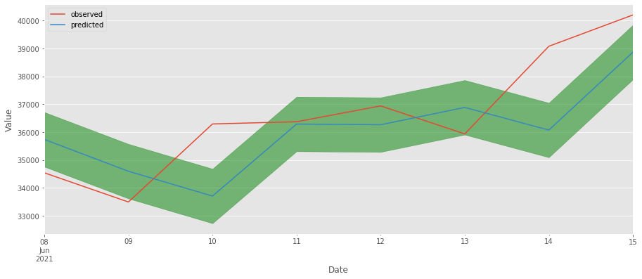
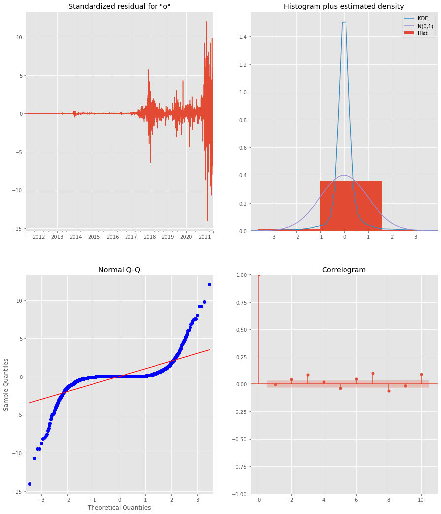

# Day Trader

The contents of this repo show the development of a SARIMA Time Series model to that predicts trends in Bitcoin's value. The model in its current state predicts daily values of Bitcoin and can be tuned to predict by hour, or even by minute to help day traders make profits within a day's time. The model in its most basic state outperformed Dollar-Cost Averaging and a blind-investment during a 28 day period of the most recent data available.

 <i>Image of Bitcoin</i>

## Problem

The pandemic has heavily impacted day to day norms, in fact the only thing predictable in today's world is the weather. Social environments, currency, government policies, work experiences, the stock market, the housing market, the restaurant scene, almost anything and everything imaginable have entered a flux that people cannot predict or control. But with technology in higher demand than ever before (triggered by the learn from home/work from home/stuck at home environments), cryptocurrency has been hovering in headlines as much as population vaccination coverage. Although there have been claims that cryptocurrency is the next big thing and tech talks of companies now accepting cryptocurrency as payment, the cryptocurrency market has seen an historical bull run and a consequent a significant drop. Is the market still lucrative? Longterm predictions are not yet promising, but the extreme volatility can prove great profits for Day Traders.

## Time Series Model Predictions

With historical Bitcoin data that has been generating for well over a decade now, there may be enough information to identify patterns in the value of Bitcoin that may not immediately come to light. Using time series analyses to explore and predict the trends of Bitcoin, even the most novice of investors can start investing amongst intermediate day traders with a better edge than typical beginner practices. Although the models may not be able to predict exact profit and loss margins, a trend up or down can be a significant enough indicator of smart investment decisions.

### The Data

[Data](https://www.kaggle.com/maxwells/btcusd) consists of Bitcoin's open, high, low, close, and tick volume values from March 20, 2011 to June 15, 2011. Bitcoin is the first and largest cryptocurrency created to date (launched in 2008).

### The Model

The model is fitted to Bitcoin's historical data and assessed on a day to day basis (every 24 hours since cryptocurrency markets run 24/7).

 <i>Visual Model Stats</i>

Do not let the qq-plots and distribution curves fool you. Bitcoin's data is largely random and unpredictable. It also increased rapidly in value in a few small bursts over the last 10 years. The data is expected to be very random.

## Conclusion

Although the model did outperform blind/random investing and dollar-cost averaging, it should not be used solely on its own to weigh an investment decision. The model should be used as a tool to enhance the decision-making process to buy or sell and should never be relied upon as a guarantee.